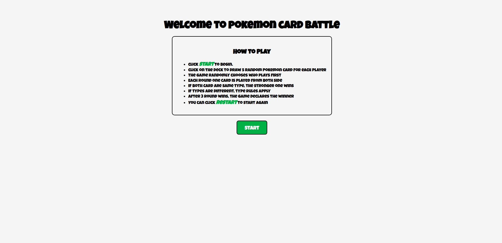
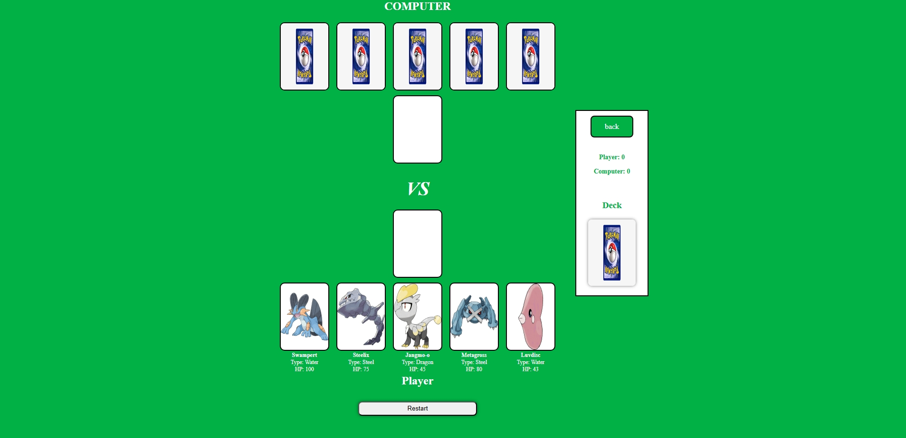
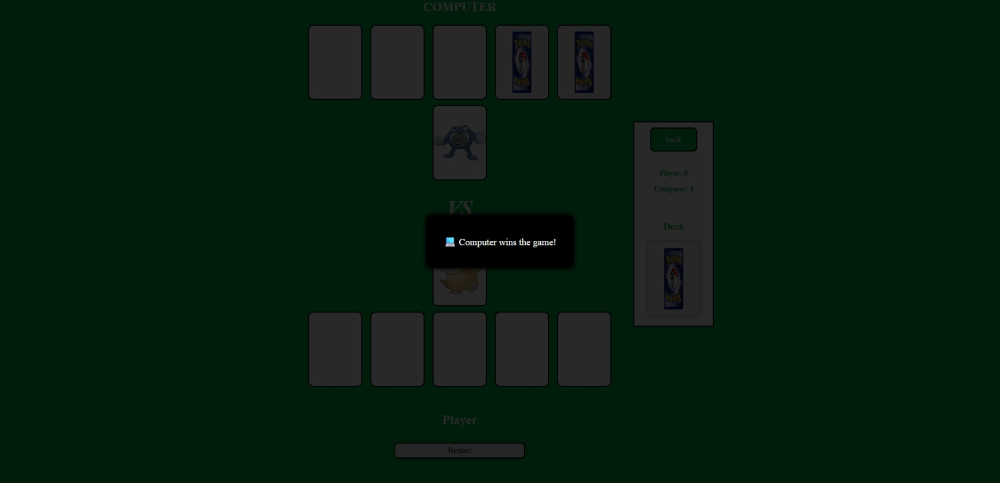

# Pokemon Card Battle Game

A browser card game using JavaScript, HTML, and CSS where the player battles against the computer using Pokemon cards.
The game is inspired by the basic rules of Pokémon type advantages and HP.

-----------------------------------------------------------------------------------------

## How to Play

1. Click the **deck image** to draw 5 random Pokemon cards for both player and computer.
2. Player cards are shown face up, computer cards are face down.
3. Click one of your cards to play it.
4. The computer will play one of its random cards.
5. The game compares the two cards:
    - If same type higher HP wins.
    - If different type uses type rule (like fire beats grass).
    - If same HP it's a draw.
6. Win 3 rounds to win the game.
7. Press **Restart** to play again and reset scores.

-----------------------------------------------------------------------------------------

## Pseudocode and Game State

### Game State Structure

```js
let playerCards = []            // drawn 5 cards for player
let computerCards = []          // drawn 5 cards for computer
let playerWins = 0              // How many round player win now
let computerWins = 0            // How many round computer win now
let playerRecord = 0            // How many full game player win
let computerRecord = 0          // How many full game computer win
let isDeckFull = false          // Don’t let draw new card until round finish
```

### Pseudocode

1. When the game starts:
   - Get the buttons and places on the screen 
   - Set all numbers to 0

2. When you click the deck:
   - If cards already given, do nothing
   - Remove the old active cards from screen
   - Give 5 random cards to player and computer
   - Show player's cards with name, type, HP
   - Show computer's cards as "back" image
   - Stop more clicks until round ends

3. When player clicks a card:
   - If the card is not empty, continue
   - Pick a random card from computer
   - Show both cards in the middle (active area)
   - Remove these cards from the bench
   - Check who wins:
     - If same type -> higher HP wins
     - If different type -> use rules (fire beats grass, etc.)
   - Show message (player win, computer win, or draw)
   - Add 1 point to winner (playerWins or computerWins)

4. After someone wins 3 rounds:
   - Show message: "Player wins the game!" or "Computer wins the game!"
   - Add 1 to big score (playerRecord or computerRecord)
   - Reset round wins to 0
   - Allow new draw

5. After all cards are used:
   - Reset round wins to 0
   - Allow new draw

6. When you click "Restart":
   - Set everything back to 0
   - Clear all cards from screen
   - Reset scores and active cards
   - Allow new draw
-----------------------------------------------------------------------------------------

## Technologies Used

- HTML
- CSS
- JavaScript

-----------------------------------------------------------------------------------------

## File Structure

```
pokemon-card-battle/
├── css/
│   ├── gameScreenStylesheet.css
│   └── welcomeScreenStylesheet.css
├── images/
│   ├── back.png
│   └── screens/
│       ├── welcomeScreen.jpeg
│       ├── gameScreen.jpeg
│       ├── popupMsgRoundWinner.jpeg
│       └── popupMsgGameWinner.jpeg
├── jss/
│   ├── app.js
│   └── pokemonList.js
├── gameScreen.html
├── welcomeScreen.html
└── README.md
```
-----------------------------------------------------------------------------------------

## Screenshots

### Welcome screen:


### Game in progress:


###  Winner popup:
##### Game Popup Msg Winner:


-----------------------------------------------------------------------------------------

## Future Improvements

- Add animation for played cards
- Add option to choose game mode: Player vs Computer or Player vs Player

-----------------------------------------------------------------------------------------
## Reference

 Pokemon data and images : [Pokemon.json](https://github.com/Purukitto/pokemon-data.json)